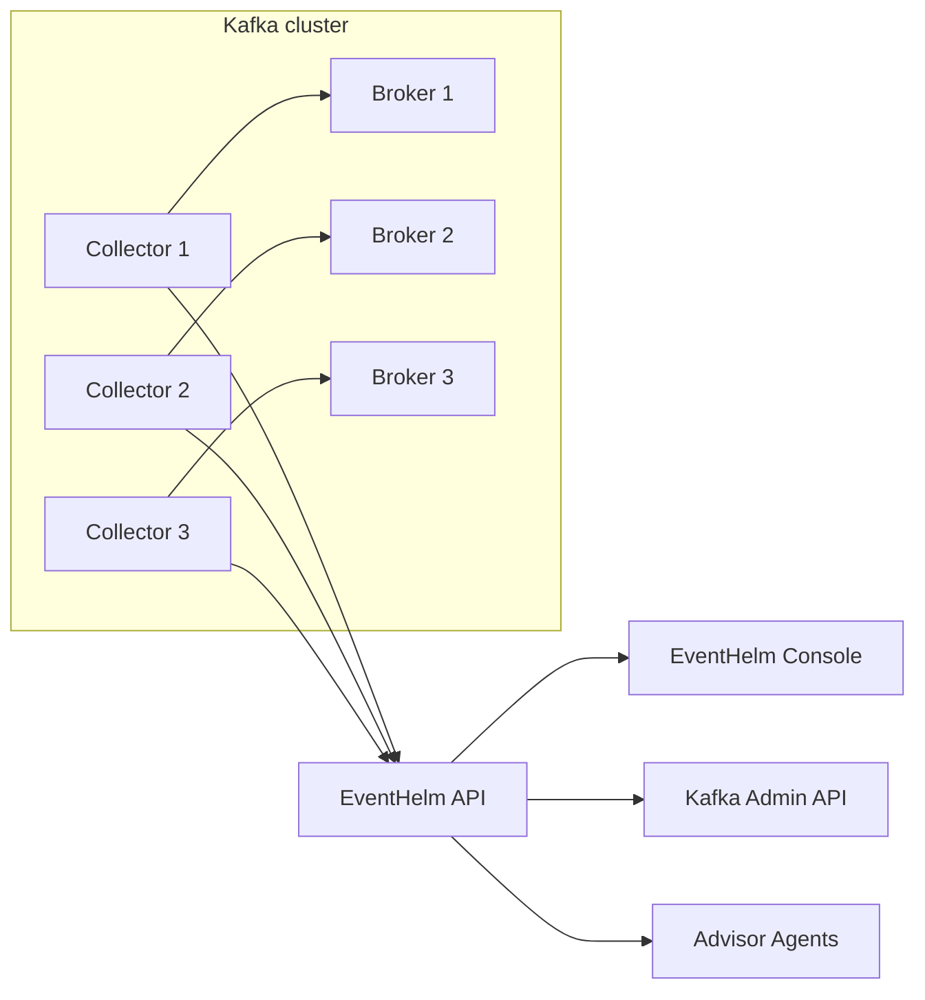

# EventHelm Architecture

EventHelm is intended to become an open-source event-streaming operations cockpit, not just a Kafka UI.

## Product Goals

- Health-first operations for Kafka clusters.
- Broker-local collectors that push telemetry to the control plane.
- Safe self-service for topics, messages, schemas, connectors, and eventually ACLs.
- Disk-aware partition rebalance planning before brokers run out of log-dir capacity.
- Advisor agents that continuously inspect UX, security, SRE, governance, and maintainership quality.
- Auditability and approval workflows for risky changes.

## Components

### API

The API owns:

- Kafka AdminClient operations.
- Message browsing and producing.
- Collector registration and snapshots.
- Advisor-agent checks.
- Security posture reporting.
- Audit events.
- Postgres persistence for audit events and collector state.
- Later: RBAC, policy checks, approval workflows.

### Web Console

The console is an operator workbench. The first screen should answer:

- Is the cluster reachable?
- Are all broker collectors fresh?
- What changed recently?
- What do the advisor agents think is risky?
- Which action should the operator take next?

### Broker Collector

Collectors run near brokers. In Docker Compose this is modeled as one collector container per broker. In Kubernetes this maps to sidecars or DaemonSets. For bare metal or VM-based Kafka clusters, the same agent can run as a systemd service on each broker host.

The collector is push-based so broker networks do not have to expose collector ports back to the control plane.

Future collector responsibilities:

- JMX metric scraping.
- Disk, network, and broker host telemetry.
- Multi-log-dir attribution and JMX cross-checks for exact data-movement planning.
- Broker config drift detection.
- Local log signal extraction.
- Optional Kafka Connect and Schema Registry probes.

### Advisor Agents

The v0 agent layer is deterministic. It uses rules against sanitized platform context and returns the same shape a future model-backed executor can return.

Current agents:

- Navigator: product and workflow quality.
- Sentinel: security posture.
- Operator: SRE and collector health.
- Steward: topic governance.
- Scribe: project maintainability.

Future agent executors can use LLMs, GitHub context, CI logs, docs, or scheduled monitors without changing the web contract.

### Disk-Aware Rebalance

EventHelm treats rebalancing as a plan-review-apply workflow:

1. Broker-local collectors report disk capacity, free space, used space, and pressure bands from the mounted broker log directory.
2. Collectors scan partition log directories and report per-partition byte sizes.
3. The API reads Kafka partition placement metadata and generates a reassignment plan that moves replicas away from disk-pressured brokers.
4. The planner scores target brokers by projected disk usage and estimates bytes moved from collector log-dir telemetry.
5. The console shows broker pressure, planned replica movements, warnings, and the Kafka reassignment JSON.
6. Execution stays locked by default until production auth, approvals, and RBAC are configured.

## Deployment Shape

## Near-Term Roadmap

1. Persist configured clusters, agent runs, findings, and rebalance plans in Postgres.
2. Add OIDC/JWT, RBAC, API tokens, and collector enrollment.
3. Add Schema Registry and Kafka Connect clients.
4. Add lag and offset operations with dry-run/approval workflows.
5. Add reassignment throttling, cancellation, and JMX validation.
6. Add GitOps import/export for topics and connector configs.
7. Add policy-as-code for topic naming, retention, partitions, replication, and payload controls.
