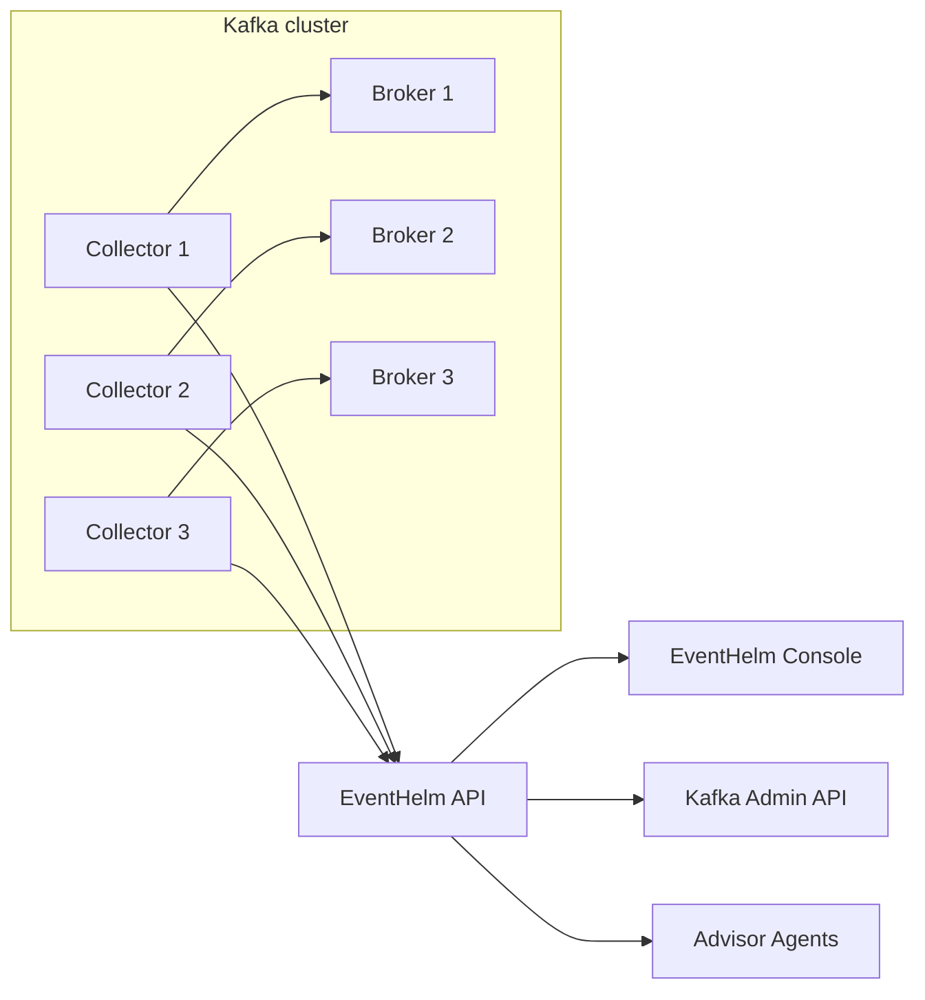

# EventHelm Architecture

EventHelm is intended to become an open-source event-streaming operations cockpit, not just a Kafka UI.

## Product Goals

- Health-first operations for Kafka clusters.
- Broker-local collectors that push telemetry to the control plane.
- Safe self-service for topics, messages, schemas, connectors, and eventually ACLs.
- Disk-aware partition rebalance planning before brokers run out of log-dir capacity.
- Advisor agents that continuously inspect UX, security, SRE, governance, and maintainership quality.
- Auditability and approval workflows for risky changes.

## Components

### API

The API owns:

- Kafka AdminClient operations.
- Topic config inspection and reviewed config updates.
- Message browsing and producing.
- Consumer group lag calculation from committed offsets and log-end offsets.
- Consumer group offset-reset previews and reviewed execution.
- Collector registration and snapshots.
- Advisor-agent checks.
- Security posture reporting.
- Audit events.
- Postgres persistence for cluster configs, audit events, collector state, rebalance plans, advisor-agent runs, and findings.
- Versioned database migrations with checksum validation in `schema_migrations`.
- Later: OIDC/JWT identity, policy checks, approval workflows.

Token mode supports scoped API tokens from `EVENTHELM_API_TOKENS_JSON` for read-only, operator, rebalance, and admin-style automation. The legacy `EVENTHELM_API_TOKEN` remains an admin token for compatibility. In token mode, audit actors and write-rate principals are derived from the authenticated token rather than caller-supplied actor headers. This is a local/deployment-token authorization layer, not a replacement for per-user identity.

Mutating API routes pass through a shared write guard that checks scope, optional write confirmation, and an optional in-memory per-actor/per-scope rate limit. Distributed rate limits and per-user quotas still belong in the future identity/control-plane layer.

### Web Console

The console is an operator workbench. The first screen should answer:

- Is the cluster reachable?
- Are all broker collectors fresh?
- What changed recently?
- What do the advisor agents think is risky?
- Which action should the operator take next?

### Broker Collector

Collectors run near brokers. In Docker Compose this is modeled as one collector container per broker. In Kubernetes this maps to sidecars or DaemonSets. For bare metal or VM-based Kafka clusters, the same agent can run as a systemd service on each broker host.

The collector is push-based so broker networks do not have to expose collector ports back to the control plane. In token auth mode, `EVENTHELM_COLLECTOR_TOKEN` is required for collector heartbeat and snapshot writes.

Current collector responsibilities:

- Heartbeats and broker identity.
- Kafka cluster snapshots.
- Disk capacity, free space, used space, and pressure bands.
- Partition log directory byte sizes for rebalance estimates.
- Host CPU count, load averages, memory pressure, and uptime.

Future collector responsibilities:

- JMX metric scraping.
- Network telemetry.
- Multi-log-dir attribution and JMX cross-checks for exact data-movement planning.
- Broker config drift detection.
- Local log signal extraction.
- Optional Kafka Connect and Schema Registry probes.

### Advisor Agents

The v0 agent layer is deterministic. It uses rules against sanitized platform context and returns the same shape a future model-backed executor can return.

Current agents:

- Navigator: product and workflow quality.
- Sentinel: security posture.
- Operator: SRE and collector health.
- Steward: topic governance.
- Scribe: project maintainability.

Future agent executors can use LLMs, GitHub context, CI logs, docs, or scheduled monitors without changing the web contract.

Manual sweeps are stored as `agent_runs` records with durable run IDs, actors, triggers, severity summaries, per-agent scores, and the full run payload. Read-side automatic sweeps are ephemeral so GET requests do not create durable control-plane state. Sweeps inspect sanitized cluster registry metadata, cluster change reviews, rebalance plan history, collector coverage, audit activity, and security settings. Persisted findings are also indexed in `agent_findings` by agent, severity, and resource so the console can show recent posture history and future automation can query evidence without replaying every sweep.

### Cluster Registry

Configured Kafka clusters are bootstrapped from environment JSON and then stored in `cluster_configs` when Postgres is enabled. The console uses `cluster_change_reviews` as a request-review-apply queue for cluster registrations, updates, and removals. Direct API writes are break-glass only: they require `EVENTHELM_ENABLE_CLUSTER_BREAKGLASS=true` plus `cluster:breakglass` or `admin` scope. Review records preserve sanitized current/proposed cluster metadata, warnings, actor decisions, and applied timestamps without exposing SASL passwords or secret reference names. Apply rejects stale reviews when the live sanitized registry state no longer matches the state captured at review creation. SASL credentials can use an inline password for local dev, but token auth mode rejects inline SASL passwords and requires `passwordEnv` for an API-process environment variable reference; production deployments still need a full external secret manager and RBAC before multi-team use.

### Disk-Aware Rebalance

EventHelm treats rebalancing as a plan-review-apply workflow:

1. Broker-local collectors report disk capacity, free space, used space, and pressure bands from the mounted broker log directory.
2. Collectors scan partition log directories and report per-partition byte sizes.
3. The API reads Kafka partition placement metadata and generates a reassignment plan that moves replicas away from disk-pressured brokers.
4. The planner scores target brokers by projected disk usage and estimates bytes moved from collector log-dir telemetry.
5. The API persists the generated plan and returns a plan ID.
6. The console shows broker pressure, planned replica movements, warnings, and the Kafka reassignment JSON.
7. Operators can review retained plan history, reload a stored plan by ID, and approve or reject the plan.
8. The console and API expose Kafka's active partition reassignment status.
9. Operators can run a preflight against a stored plan. The preflight checks the execution switch, approval state, executable plan shape, movement byte-estimate coverage, active Kafka reassignments, reviewed placement drift, under-replicated or offline planned partitions, collector disk coverage, collector freshness, and planner warnings.
10. Execution accepts only approved stored plan IDs, claims a single in-flight `executing` plan per cluster, reruns the same preflight gate, and refuses to call Kafka when any critical check fails.
11. EventHelm marks an executing plan `executed` only after Kafka reports no active reassignment and live replica placement matches the proposed assignments.
12. Execution stays locked by default until production auth, RBAC, and deployment-specific safeguards are configured.

### Consumer Offset Reset

EventHelm treats offset reset as preview-review-execute:

1. The console requests a preview for a group, topic, mode, and optional partition set.
2. The API reads committed group offsets and topic low/high offsets from Kafka.
3. The API calculates proposed offsets, projected lag, skipped/replayed record counts, warnings, and a review token.
4. Running consumer groups and out-of-range absolute offsets produce non-executable previews.
5. Execution requires write confirmation headers and the review token.
6. The API recomputes the preview from live Kafka state and rejects stale tokens before calling KafkaJS `setOffsets`.
7. Successful resets are recorded in the audit ledger with the token and summary counts.

### Topic Config Updates

EventHelm treats topic config changes as reviewed mutations:

1. The API reads configs with KafkaJS `describeConfigs`.
2. The console exposes an allowlist of common mutable configs rather than arbitrary broker knobs.
3. Preview validates values, calculates effective changes, preserves existing dynamic overrides, and returns a review token.
4. Execution recomputes the plan, rejects stale tokens, calls Kafka `alterConfigs` with `validateOnly` before applying, and verifies the requested values are visible after apply.
5. Successful changes are recorded in the audit ledger with old values, new values, and review token.

## Deployment Shape

## Near-Term Roadmap

1. Add production deployment metadata and external secret references.
2. Add OIDC/JWT, per-user RBAC, and collector enrollment.
3. Add Schema Registry and Kafka Connect clients.
4. Add approval queues for offset resets, topic config changes, and topic mutations.
5. Add reassignment throttling, cancellation, and JMX validation.
6. Add GitOps import/export for topics and connector configs.
7. Add policy-as-code for topic naming, retention, partitions, replication, and payload controls.
