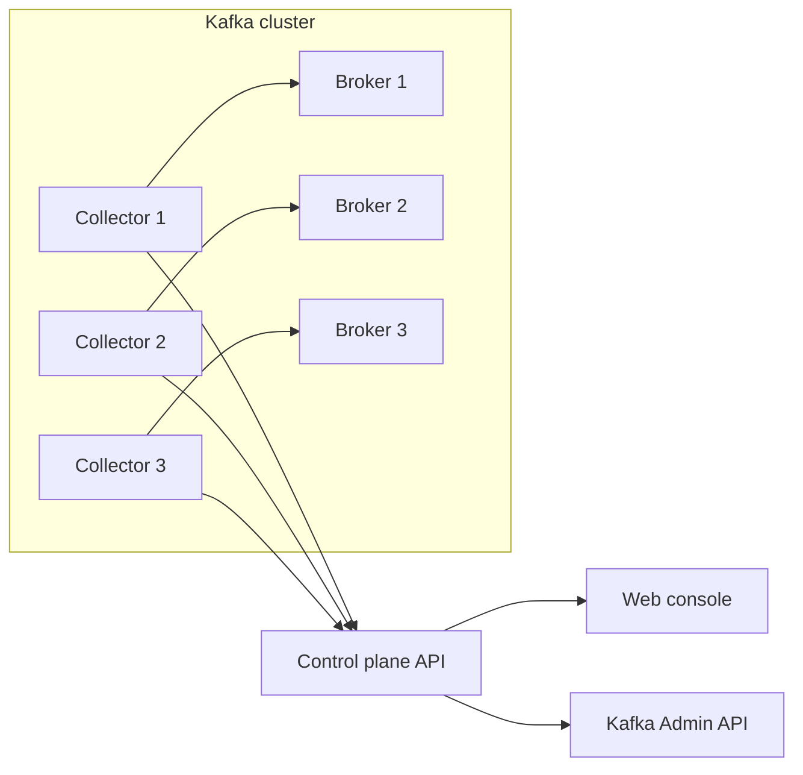

# Architecture

## Goals

Open Kafka Control Plane is intended to be more than a message browser. The target is a practical operations platform for Kafka:

- Safe self-service for developers.
- Multi-cluster visibility for platform teams.
- Broker-local collectors for health, inventory, and operational telemetry.
- Auditability for every mutating action.
- A future GitOps/policy layer for topics, ACLs, schemas, and connectors.

## Components

### API

The API owns:

- Kafka AdminClient operations.
- Message browsing and producing.
- Collector registration and snapshots.
- Audit events.
- Later: persistence, RBAC, policy checks, approval workflows.

### Web Console

The console is a work surface for operators. It starts with cluster inventory, topics, consumer groups, message tools, collector health, and audit events.

### Collector

Collectors run close to Kafka brokers. The first agent gathers cluster metadata using Kafka APIs and pushes heartbeats/snapshots to the API.

Future collector responsibilities:

- JMX metric scraping.
- Disk, network, and broker host telemetry.
- Broker config drift detection.
- Local log signal extraction.
- Optional Kafka Connect and Schema Registry probes.

## Deployment Shape

## Near-Term Roadmap

1. Persist clusters, audit logs, collectors, and snapshots in Postgres.
2. Add Schema Registry and Kafka Connect clients.
3. Add RBAC and OIDC.
4. Add approval workflows for production mutations.
5. Add GitOps import/export for topics and connector configs.
